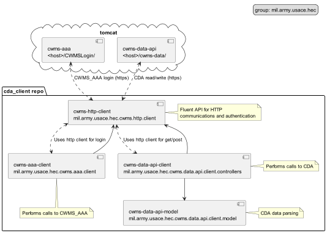

[](https://github.com/HydrologicEngineeringCenter/cwms-data-api-client/actions/workflows/deploy.yml)[](https://github.com/HydrologicEngineeringCenter/cwms-data-api-client/actions/workflows/build.yml)[](https://github.com/HydrologicEngineeringCenter/cwms-data-api-client/actions/workflows/codeql.yml)
  

### <span style="color:orange">Notice</span>
CWMS RADAR is undergoing a rename process to CWMS DATA API. 
This repository name will be changed as well as the artifacts/packages/classes in a future release.
This will follow the guidance and process of the [cwms-data-api](https://github.com/USACE/cwms-data-api) repository
rename effort.



# cwms-http-client
An HTTP client API for performing REST calls as well as adding authentication and HTTPS support.

# cwms-data-api-client

Client Side libraries to assist with Accessing CWMS Data API.

# cwms-data-api-model

Data objects serialized from CWMS Data API for client use.

# cwms-aaa-client

Client API access for the CWMS_AAA web app used to authenticate calls to CWMS Data API.

## Artifacts
Artifacts are deployed to [HEC Nexus](https://www.hec.usace.army.mil/nexus) with browsable links below:

- [cwms-http-client](https://www.hec.usace.army.mil/nexus/#browse/browse:maven-public:mil%2Farmy%2Fusace%2Fhec%2Fcwms-http-client)
- [cwms-data-api-client](https://www.hec.usace.army.mil/nexus/#browse/browse:maven-public:mil%2Farmy%2Fusace%2Fhec%2Fcwms-data-api-client)
- [cwms-data-api-model](https://www.hec.usace.army.mil/nexus/#browse/browse:maven-public:mil%2Farmy%2Fusace%2Fhec%2Fcwms-data-api-model)
- [cwms-aaa-client](https://www.hec.usace.army.mil/nexus/#browse/browse:maven-public:mil%2Farmy%2Fusace%2Fhec%2Fcwms-aaa-client)

# Debug Logging

cwms-http-client uses [Java Util Logger](https://docs.oracle.com/javase/8/docs/api/java/util/logging/Logger.html)
for logging HTTP calls.

To enable debug logging, add the following to your application's log.properties
file to turn on
OkHttp's [HttpLoggingInterceptor.BASIC](https://square.github.io/okhttp/3.x/logging-interceptor/okhttp3/logging/HttpLoggingInterceptor.Level.html#BASIC)
logging level:

```
mil.army.usace.hec.cwms.http.client.CwmsHttpLoggingInterceptor.level = FINE
```

For more verbose logging, add the following to your application's log.properties file
to turn on
OkHttp's [HttpLoggingInterceptor.BODY](https://square.github.io/okhttp/3.x/logging-interceptor/okhttp3/logging/HttpLoggingInterceptor.Level.html#BODY)
logging level:

```
mil.army.usace.hec.cwms.http.client.CwmsHttpLoggingInterceptor.level = ALL
```


